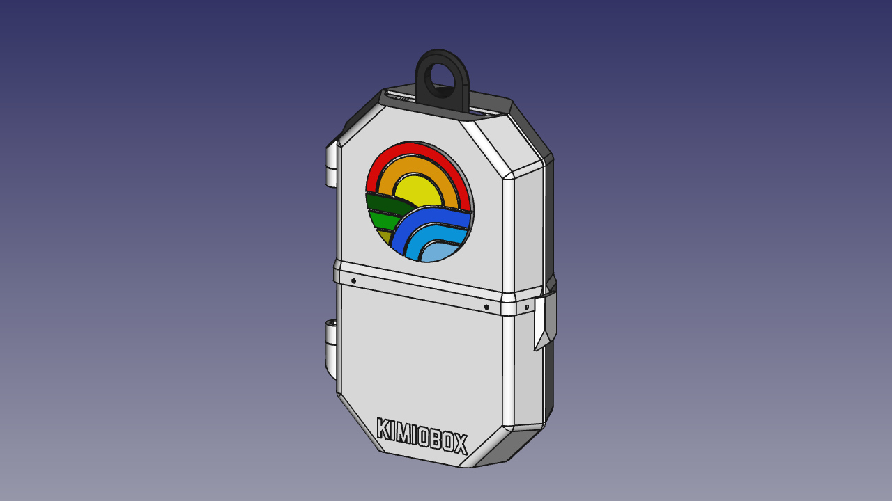

# SuperHero ChemoBox



## Description

This is a wonderful initiative by ["kurioso"](https://www.thingiverse.com/kurioso/about). It's a box to decorate the chemotherapy bags of children with cancer. As it is stated in [the original](https://www.thingiverse.com/thing:2808979):

```
Covers for children intravenous bags. A child-friendly version for a best treatment.
"If you take this, you will be as strong as batman". That's the idea

```

For this remix I traced the original stls, and made  [FreeCAD][FreeCADlink] files for it, so it can be edited with the tools of the FOSS community.

I also made small changes for printability. Although the model is still not yet polished.

## Print Instructions

Parts have been already oriented to be printed easily.
The box is printed it two stls, that combines the two halves of each half of the box. This way, you don't have to use support material.

## Bill of Materials

- 1 x M5x10mm Bolt. (DIN912 recommended)
- 2 x M5x20mm Countersunk Bolt (DIN7991 recommended)
- 3 x M5 nuts.
- 4 x M3x8mm Bolt (DIN912 recommended)
- 4 x M3 nuts.
- Superglue to glue the superhero icon.


## TODO
Among the changes I would make until is finished I can name:
- Make printable sticks for the hinges, in case you don't have bolts.
- Add magnets to the door, so it closes easily. (I think someone made this already)

## About this repository

**WARNING: This repo uses FreeCAD 0.16, FreeCAD 0.17 is too recent and the files haven't been migrated yet.**

This repository holds the mechanical information of the device, and wiki. Android app information and firmware information are held in other repos.

* `src`: Source files in .FCStd format.
* `stl`: STL files for 3D printing.
* `stl_original`: Original STL files kept for historical purposes.
* `doc`: useful files for documentation

### Contributing to this repository. Developer notes

You can contribute to this repo by forking it, and making pull requests straight to the [master branch][Develop]. If you find problems to make the contribution this way, [place an issue][issue] and we'll work it out.

Due to FCStd files being unmergeable, Assembly.FCStd is modified only on the Development branch. It may not be included in pull requests.

**This repo relies heavily on [@hamish_2014 's Assemblyv2 workbench][Assemblyv2Link].** The assembly file is composed almost entirely of Assemblyv2 objects, every file has reference items that are imported dynamically using this workbench. **These files may not be usable if your FreeCAD distribution doesn't have this workbench installed.**

Also, there may be files that use [@DeepSOIC 's Lattice2 workbench][LatticeLink]'s Recompute locker. This may be used to avoid FreeCAD to recompute a whole file each time an operation is readjusted.

[FreeCADlink]: http://www.freecadweb.org/
[issue]: https://github.com/gvJaime/ChemoBox/issues/new
[Develop]: https://github.com/gvJaime/ChemoBox/tree/master
[Assemblyv2Link]: https://github.com/hamish2014/FreeCAD_assembly2
[LatticeLink]: https://github.com/DeepSOIC/Lattice2
